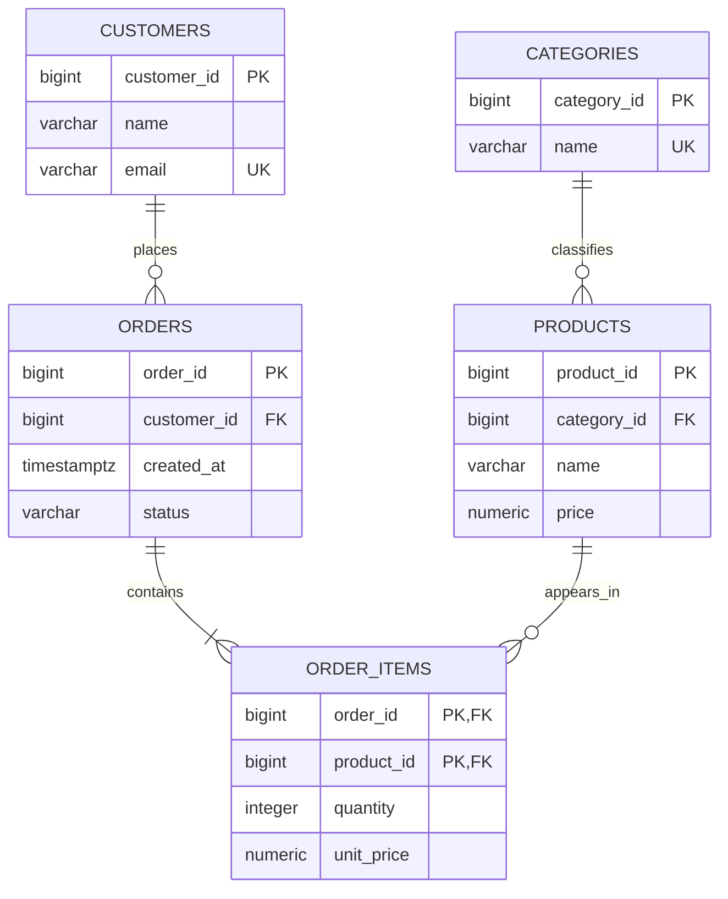
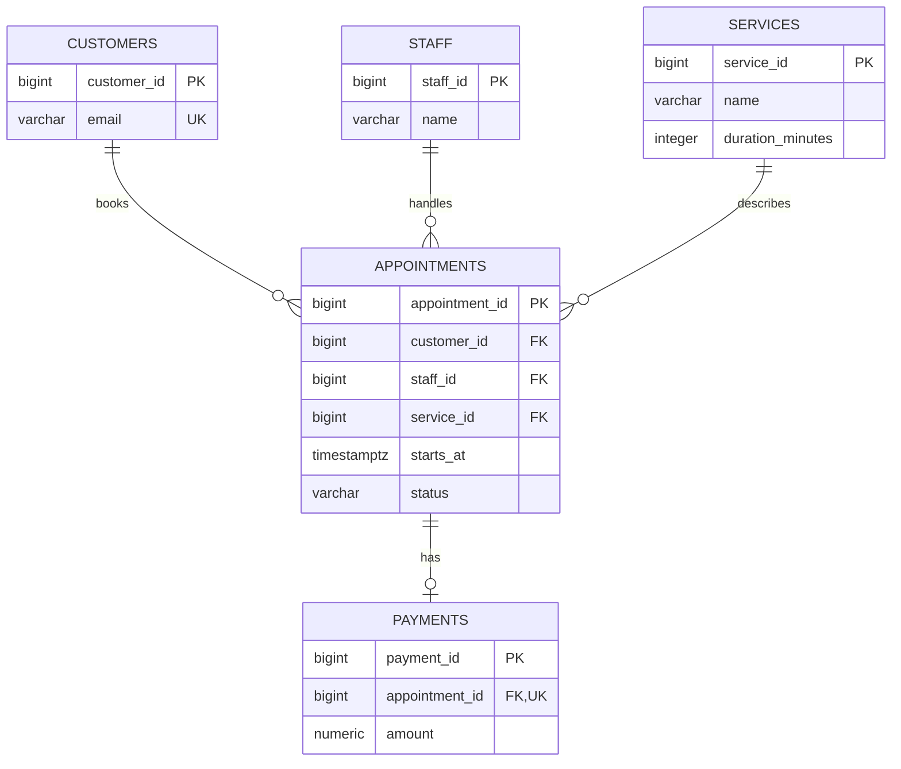
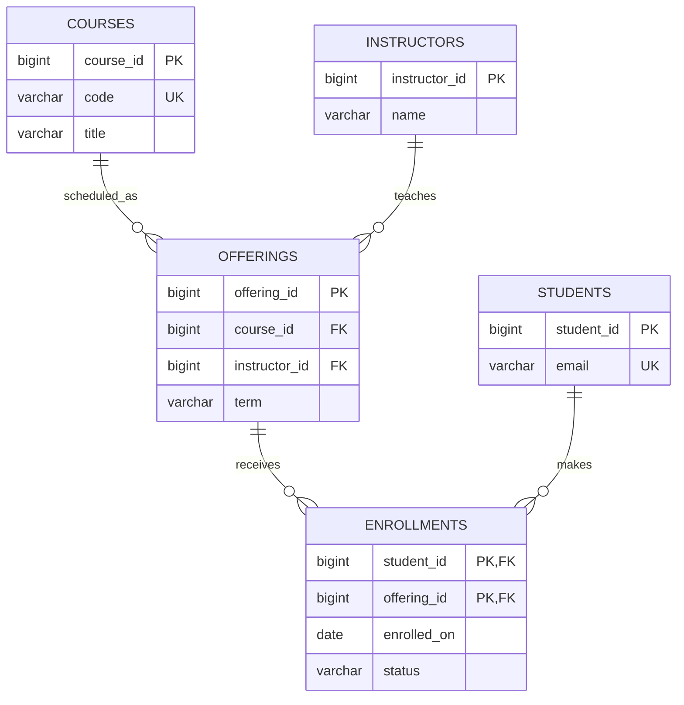

# Database Fundamentals, RDBMS, and ERD Design

## What Is Data?

### Data

- **Facts in raw or organized form**: text, numbers, dates, images, and events.
- **Examples include a customer's email, a product price, or an order date.**
- **Data becomes useful when it can be organized, checked, searched, and interpreted.**

## Why Databases?

Most apps have three layers: the **frontend** (what the user sees), the **backend** (the server that applies app rules), and the **database** (where the app's lasting data is stored).

- **The frontend sends a request to the backend, such as creating an order.**
- **The backend checks the request, applies business rules, and reads or changes database records.**
- **A backend is commonly designed to be stateless between requests**: it does not rely on its memory to remember a user's data or the previous request.
- **The database provides durable, shared storage, so data remains available across requests, app restarts, and multiple backend instances.**
- **In our demo, the HTML/JavaScript frontend calls FastAPI, and FastAPI reads and writes customers, products, and orders in PostgreSQL.**

That is why we study databases: they let applications keep, organize, relate, validate, and retrieve the data their users depend on.

## DBMS

### What Is a DBMS?

A Database Management System is software that creates, stores, retrieves, protects, and maintains databases. PostgreSQL, MySQL, Oracle Database, Microsoft SQL Server, MongoDB, and Redis are examples of database systems.

### What It Does

- **Stores and retrieves data.**
- **Enforces rules such as required fields and unique email addresses.**
- **Controls users, permissions, and concurrent access.**
- **Coordinates transactions so related changes succeed or fail together.**
- **Provides backup and recovery tools.**
- **Offers indexes and query planning to find data efficiently.**

### Server to Table

- **Database server**: the running PostgreSQL service or container.
- **Database**: a named collection of schemas and data, such as `shop_db`.
- **Schema**: a namespace grouping tables and other objects; PostgreSQL creates `public` by default.
- **Table**: related rows and columns, such as `products`.
- **In the demo, Docker runs the server, `shop_db` is the database, and FastAPI and DBeaver are clients.**

## Database Models

Different database models suit different needs. Many applications combine more than one.

### Relational Databases

- **Store data in tables with typed columns and rows.**
- **Use SQL to create, read, and change data.**
- **Link tables with primary and foreign keys.**
- **Use constraints and transactions to protect correctness.**
- **Good fit for orders, payments, inventory, bookings, and other data with clear relationships.**
- **Examples**: PostgreSQL, MySQL, SQL Server, Oracle Database.

### Non-Relational Databases

Often called NoSQL, these use models other than the traditional relational table model. Their flexibility does not mean they have no structure or rules.

#### Key-Value Stores

- **Store values under unique keys, much like a dictionary.**
- **Fast access by key; usually limited ad-hoc querying across values.**
- **Use cases**: caching, sessions, feature flags, and short-lived carts.
- **Examples**: Redis, Amazon DynamoDB.

#### Document Databases

- **Store documents commonly shaped like JSON.**
- **Useful when related fields are naturally read and written together or records vary in shape.**
- **Use cases**: content, product catalogs, and flexible profiles.
- **Examples**: MongoDB, CouchDB.

#### Graph Databases

- **Store entities as nodes and connections as edges.**
- **Useful when traversing many relationships is central to the workload.**
- **Use cases**: social connections, recommendations, and fraud networks.
- **Examples**: Neo4j, Amazon Neptune.

#### Vector Databases

- **Store vector representations and search for nearby vectors by similarity.**
- **Useful for semantic search, recommendations, and AI retrieval.**
- **Examples**: pgvector with PostgreSQL, Chroma, Weaviate, Pinecone.

### Choosing One

Ask what the application must query, how relationships are used, how consistent the data must be, and how its workload is expected to grow. Choose based on the access patterns and requirements rather than on a database being fashionable.

## The Relational Model

### Tables, Rows, Columns

- **A table represents a kind of thing, such as `customers`.**
- **A row represents one instance, such as one registered customer.**
- **A column represents one property, such as `email` or `created_at`.**
- **Each cell stores one value of the column's type.**
- **Row order is not guaranteed; use `ORDER BY` when order matters.**

### Entities and Relationships

- **Entity**: a thing or event the app needs to remember; often becomes a table.
- **Attribute**: a property of an entity; often becomes a column.
- **Relationship**: a rule about how records connect; represented by keys and constraints.
- **Use nouns for entities (`customer`, `order`) and verbs to describe relationships (`places`, `contains`).**

### ERDs and Mermaid

An Entity-Relationship Diagram is a blueprint for data: it helps the team agree on entities, properties, keys, and relationship rules before building tables. Traditional Chen diagrams may show entities as rectangles, attributes as ovals, and relationships as diamonds. Mermaid's `erDiagram` syntax instead lists attributes inside entity boxes and draws relationships between boxes. The notation differs, but the design ideas are the same.

### Relationship Types

- **One-to-one (1:1)**: one user has at most one settings row. Use a foreign key with `UNIQUE` on the dependent table when the separate table is useful.
- **One-to-many (1:M)**: one customer can place many orders; each order belongs to one customer. Put the foreign key on the many side (`orders.customer_id`).
- **Many-to-many (M:N)**: an order contains many products and a product can appear in many orders. Create a junction table (`order_items`) and put each side's foreign key there.
- **Optionality answers whether a relationship may be absent.** For example, an order may have no shipment record until it is dispatched.

## Keys and Rules

### Primary Key

- **Identifies one row uniquely and cannot be null.**
- **Prefer stable identifiers such as `customer_id`; names and emails can change.**
- **PostgreSQL identity example**: `customer_id INTEGER GENERATED ALWAYS AS IDENTITY PRIMARY KEY`.

### Foreign Key

- **Requires a value to match a key in another table, maintaining referential integrity.**
- **A nullable foreign key represents an optional relationship; `NOT NULL` makes it required.**
- **Choose delete behavior deliberately**: `RESTRICT`/default prevents deleting referenced records; `CASCADE` deletes dependent rows; `SET NULL` preserves dependent rows without the link.

### Other Constraints

#### UNIQUE

Prevents duplicate values, such as a customer's email address.

#### Composite Key

Uses multiple columns together as a key. For example, `(order_id, product_id)` can ensure that each product appears only once per order.

#### CHECK

Rejects values that do not meet a condition, such as `quantity > 0` or `price >= 0`.

#### NOT NULL and DEFAULT

Use `NOT NULL` when a value is required. Use `DEFAULT` to provide a value when one is omitted.

### Indexes

- **An index helps PostgreSQL find or join rows without scanning a whole table in many cases.**
- **Primary keys and unique constraints create indexes automatically; foreign key columns often need an index for common joins and parent deletes.**
- **Index columns used often in filters, joins, and ordering after checking actual query patterns.**
- **Indexes use storage and make writes more expensive, so don't index every column.**

## Data Types

- **`INTEGER`** stores whole numbers from about −2.1 billion to +2.1 billion. It is suitable for counts and most app IDs.
- **`BIGINT`** stores whole numbers in a much larger range. Use it when a table could exceed roughly 2.1 billion IDs or values; it takes more storage than `INTEGER`.
- **`SMALLINT`** stores small whole numbers, from about −32,000 to +32,000. It can suit a small rating scale or a month number.
- **`UUID`** stores a universally unique identifier, such as `a0eebc99-9c0b-4ef8-bb6d-6bb9bd380a11`. It is useful when IDs are created by multiple services or need to be hard to guess.
- **Identity columns** generate numeric IDs automatically. For example, `customer_id INTEGER GENERATED ALWAYS AS IDENTITY` generates a new integer when a customer row is inserted.
- **`NUMERIC(10,2)`** stores exact decimal values with up to 10 digits total and 2 after the decimal point, such as `12345678.90`. Use it for prices; avoid approximate floating-point types for money.
- **`BOOLEAN`** stores `TRUE` or `FALSE`, such as whether a product is active.
- **`VARCHAR(n)`** stores text up to `n` characters; **`TEXT`** stores text without a declared length limit. Use either for names, descriptions, or other text.
- **`DATE`** stores a calendar date, such as a birth date. **`TIMESTAMP`** stores date and time without timezone handling; **`TIMESTAMPTZ`** stores a date and time representing a specific moment, useful for order creation times.
- **`INTERVAL`** stores a duration, such as `2 hours` or `3 days`.
- **`JSONB`** stores JSON in a format PostgreSQL can query and index. Use it for flexible fields that vary between records; use regular columns for important fields commonly filtered or joined.
- **Choose a type based on the values and operations needed.** For example, use a numeric type for arithmetic and a date/time type for sorting events chronologically.

## Normalization

Normalization is the process of splitting data into related tables to **reduce repeated information** and prevent data from becoming inconsistent.

### Before Normalization

Imagine storing one order per row, with customer details and a fixed set of product columns. Here an order can contain at most three products:

| order_id | date | customer | email | city | product_1 | price_1 | qty_1 | product_2 | price_2 | qty_2 | product_3 | price_3 | qty_3 | total |
|---:|---|---|---|---|---|---:|---:|---|---:|---:|---|---:|---:|---:|
| 501 | Sep 10 | Aisha Khan | aisha@example.com | Lahore | Mouse | 24.99 | 1 | USB-C Cable | 8.99 | 2 | — | — | — | 42.97 |
| 502 | Sep 11 | Aisha Khan | aisha@example.com | Lahore | Laptop Stand | 39.00 | 1 | — | — | — | — | — | — | 39.00 |
| 503 | Sep 12 | Bilal Ahmed | bilal@example.com | Karachi | Mouse | 24.99 | 1 | Headphones | 45.00 | 1 | Webcam | 54.95 | 1 | 124.94 |

### Problems with This Design

- **Repeated data:** Aisha's name and email are stored once for every product in her order.
- **Fixed product columns:** The table has an arbitrary limit of three products; adding more requires new columns and changes to queries and app code.
- **Many empty cells:** Orders with fewer products leave product columns empty.
- **Update problem:** If Aisha changes her email or city, every order row must be updated. Missing one creates conflicting values.
- **Insert problem:** We cannot store a customer or product until it appears in an order, unless we add a row with empty transaction fields.
- **Delete problem:** Deleting Aisha's last order could also erase the only copy of her details.
- **Price/history ambiguity:** A product's current name or price may change, while old orders must retain what was purchased and paid at that time.

### After Normalization: Transaction Tables

Store each kind of information once. Give each table a primary key and connect related records with foreign keys.

**customers**

| customer_id | name | email |
|---:|---|---|
| 1 | Aisha Khan | aisha@example.com |
| 2 | Bilal Ahmed | bilal@example.com |

**orders**

| order_id | customer_id |
|---:|---:|
| 501 | 1 |
| 502 | 2 |

**products**

| product_id | product_name |
|---:|---|
| 10 | Wireless Mouse |
| 11 | USB-C Cable |

**order_items** stores each product line in an order, including its purchase-time price. This preserves order history if the product's current price later changes.

| order_id | product_id | quantity | unit_price |
|---:|---:|---:|---:|
| 501 | 10 | 1 | 24.99 |
| 501 | 11 | 2 | 8.99 |
| 502 | 10 | 1 | 39.00 |

In this app database, `orders` is the transaction header, and each `order_items` row is one transaction line. The line table can also serve as the **sales fact table** for basic reporting: each row records a product sold in an order, and `quantity` and `unit_price` are measurable facts.

### Sales Fact Table for Reporting

For analytics, a separate fact table may be built from the transaction tables. Each row represents one product line sold. Dimension keys let reports group facts by customer, product, or date:

| order_id | customer_id | product_id | order_date | quantity | unit_price | line_total |
|---:|---:|---:|---|---:|---:|---:|
| 501 | 1 | 10 | 2026-09-10 | 1 | 24.99 | 24.99 |
| 501 | 1 | 11 | 2026-09-10 | 2 | 8.99 | 17.98 |
| 502 | 1 | 10 | 2026-09-11 | 1 | 39.00 | 39.00 |

This fact table is usually **derived from** the transaction tables for reporting; it is not a replacement for the app's source-of-truth records. The repeated customer and product keys make it easy to join to customer and product details and aggregate measures such as units sold and revenue.

Now customer details are stored once, product details are stored once, and order lines connect products with orders. Primary and foreign keys keep these relationships clear, while the fact table gives analysts a row-by-row view of sales.

## Transactions and ACID

- **Atomicity**: all steps in a transaction happen or none do.
- **Consistency**: constraints remain satisfied after a transaction.
- **Isolation**: concurrent transactions are controlled so they don't observe invalid intermediate work.
- **Durability**: committed changes survive failures according to the configured storage and recovery guarantees.
- **Example**: creating an order, adding its items, and reducing stock should be one transaction. If a required step fails, roll back the whole operation.
- **Transactions do not replace good constraints; both are needed for reliable data.**

## ERD Examples

### Scenario 1: Online Store Demo

Customers place orders. An order contains products; each line records quantity and the price at purchase time. Products belong to categories.

**Solution:** `order_items` resolves the order/product many-to-many relationship. Its composite key prevents duplicate product lines; alternatively add `order_item_id` and a `UNIQUE(order_id, product_id)` constraint. Keep `unit_price` on each line as a purchase snapshot. This is the core schema used by the demo app.

### Scenario 2: Appointment Booking

Customers book time slots with staff. Prevent two active appointments for the same staff member at the same start time.

**Solution:** Store each booking as an appointment row. Add a unique constraint on `(staff_id, starts_at)` when slots have a fixed start time, or use an appropriate range/exclusion constraint when appointments have variable durations. Payment is optional and one-to-one, so it can be absent until payment is recorded.

### Scenario 3: Learning Platform

Students enroll in classes; a student may take many classes and each class may have many students. Each class belongs to a course offering for a term.

**Solution:** `enrollments` is the junction table for the many-to-many student/offering relationship. The composite key prevents the same student enrolling twice in the same offering; status can track withdrawal without deleting history.

## Design Checklist

1. What real things or events must the app remember?
2. Which values belong to each entity, and which must be unique or required?
3. Can values change over time? Is a historical snapshot needed?
4. What is the cardinality and optionality at both ends of every relationship?
5. Which side should store the foreign key? Does an M:N relationship need a junction table?
6. What should happen when a referenced row is deleted?
7. Which rules should the database enforce with constraints?
8. Which query patterns are common enough to justify an index?

## PostgreSQL

PostgreSQL is an open-source relational DBMS. It provides SQL, transactions, foreign keys, constraints, indexing, and rich data types. This course uses PostgreSQL because it is suitable for practical applications and pairs directly with the FastAPI demo. SQL concepts transfer to other relational databases, though some syntax and administration commands differ.

## Next

Start PostgreSQL in Docker, connect with DBeaver, and follow the demo app setup. Use DBeaver to inspect the app's tables and query its data.
