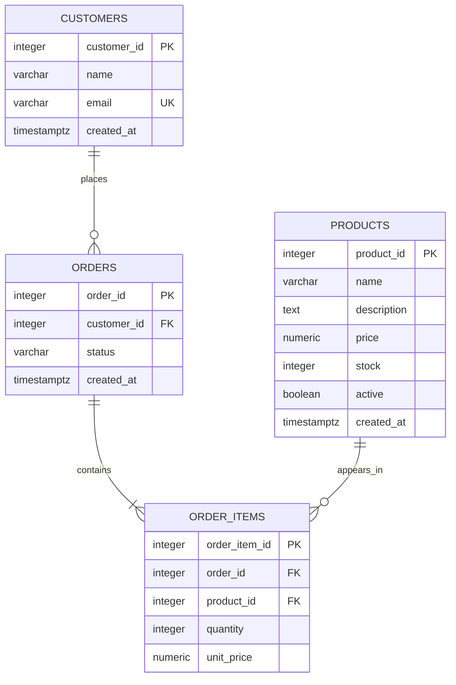

# Beginner's PostgreSQL Course — Queries on the Shop Demo App

## What Is SQL?

SQL (Structured Query Language) is used to define, read, and change data in relational databases. In this lesson, run SQL in DBeaver against the `shop_db` database used by the FastAPI demo app.

## The Big Four: CRUD Operations

1. **CREATE** data with `INSERT`.
2. **READ** data with `SELECT`.
3. **UPDATE** existing data with `UPDATE`.
4. **DELETE** data with `DELETE`.

```sql
-- READ
SELECT * FROM products;

-- CREATE
INSERT INTO products (name, description, price, stock)
VALUES ('USB-C Cable', 'One-meter charging cable', 8.99, 30);

-- UPDATE
UPDATE products SET price = 7.99 WHERE name = 'USB-C Cable';

-- DELETE
DELETE FROM products WHERE name = 'USB-C Cable';
```

## Setting Up Our Practice Database

Use the PostgreSQL demo app's `shop_db`. The API creates the same tables when it starts. You can also set up a fresh database from DBeaver by running the SQL below in order. If the app is already running, tables exist; skip the `CREATE TABLE` statements and use the sample-data inserts only if you want additional rows.

### Database Structure Diagram



- `customers` stores people who use the shop.
- `products` stores products and current stock.
- `orders` belongs to one customer.
- `order_items` connects orders to products and stores quantity and purchase-time price.
- `PK` = primary key, `FK` = foreign key, `UK` = unique key.

### Create the Tables and Sample Data

Run this only for a fresh `shop_db`. The table structure matches the FastAPI app.

```sql
CREATE TABLE customers (
    customer_id INTEGER GENERATED ALWAYS AS IDENTITY PRIMARY KEY,
    name VARCHAR(100) NOT NULL,
    email VARCHAR(255) NOT NULL UNIQUE,
    created_at TIMESTAMPTZ NOT NULL DEFAULT CURRENT_TIMESTAMP
);

CREATE TABLE products (
    product_id INTEGER GENERATED ALWAYS AS IDENTITY PRIMARY KEY,
    name VARCHAR(120) NOT NULL,
    description TEXT,
    price NUMERIC(10, 2) NOT NULL CHECK (price >= 0),
    stock INTEGER NOT NULL DEFAULT 0 CHECK (stock >= 0),
    active BOOLEAN NOT NULL DEFAULT TRUE,
    created_at TIMESTAMPTZ NOT NULL DEFAULT CURRENT_TIMESTAMP
);

CREATE TABLE orders (
    order_id INTEGER GENERATED ALWAYS AS IDENTITY PRIMARY KEY,
    customer_id INTEGER NOT NULL REFERENCES customers(customer_id) ON DELETE RESTRICT,
    status VARCHAR(20) NOT NULL DEFAULT 'pending'
        CHECK (status IN ('pending', 'paid', 'shipped', 'cancelled')),
    created_at TIMESTAMPTZ NOT NULL DEFAULT CURRENT_TIMESTAMP
);

CREATE TABLE order_items (
    order_item_id INTEGER GENERATED ALWAYS AS IDENTITY PRIMARY KEY,
    order_id INTEGER NOT NULL REFERENCES orders(order_id) ON DELETE CASCADE,
    product_id INTEGER NOT NULL REFERENCES products(product_id) ON DELETE RESTRICT,
    quantity INTEGER NOT NULL CHECK (quantity > 0),
    unit_price NUMERIC(10, 2) NOT NULL CHECK (unit_price >= 0),
    UNIQUE (order_id, product_id)
);

CREATE INDEX idx_orders_customer_id ON orders(customer_id);
CREATE INDEX idx_order_items_product_id ON order_items(product_id);

INSERT INTO customers (name, email) VALUES
('Aisha Khan', 'aisha@example.com'),
('Bilal Ahmed', 'bilal@example.com'),
('Sara Malik', 'sara@example.com'),
('Hamza Ali', 'hamza@example.com'),
('Noor Iqbal', 'noor@example.com'),
('Omar Shah', 'omar@example.com');

INSERT INTO products (name, description, price, stock) VALUES
('Wireless Mouse', 'Bluetooth mouse', 24.99, 18),
('Mechanical Keyboard', 'Compact keyboard', 69.50, 12),
('USB-C Cable', 'One-meter charging cable', 8.99, 30),
('Laptop Stand', 'Adjustable aluminum stand', 39.00, 9),
('Webcam', '1080p USB webcam', 54.95, 14),
('Headphones', 'Wired over-ear headphones', 45.00, 7);

INSERT INTO orders (customer_id, status, created_at) VALUES
(1, 'paid', '2026-01-10 10:00:00+00'),
(1, 'shipped', '2026-01-12 11:00:00+00'),
(2, 'pending', '2026-01-15 12:00:00+00'),
(3, 'paid', '2026-01-16 13:00:00+00'),
(4, 'cancelled', '2026-01-18 14:00:00+00'),
(5, 'paid', '2026-01-20 15:00:00+00');

INSERT INTO order_items (order_id, product_id, quantity, unit_price) VALUES
(1, 1, 1, 24.99),
(1, 3, 2, 8.99),
(2, 2, 1, 69.50),
(3, 4, 1, 39.00),
(3, 3, 1, 8.99),
(4, 5, 1, 54.95),
(4, 6, 1, 45.00),
(5, 1, 1, 24.99),
(6, 2, 1, 69.50),
(6, 4, 1, 39.00);
```

In the app, order creation also reduces product stock. The sample rows above teach relational queries and don't automatically change stock.

## 1. Data Retrieval — The SELECT Statement

### Basic SELECT

```sql
-- Show all products
SELECT * FROM products;

-- Show selected customer columns
SELECT name, email FROM customers;

-- Show all orders
SELECT * FROM orders;
```

`*` means all columns. In real work, select only columns you need.

### Filtering with WHERE

```sql
-- Products that cost exactly 39.00
SELECT * FROM products WHERE price = 39.00;

-- Orders that are paid
SELECT * FROM orders WHERE status = 'paid';

-- Products with low stock
SELECT * FROM products WHERE stock < 10;
```

### Comparison Operators

```sql
-- Products more expensive than 40
SELECT * FROM products WHERE price > 40;

-- Products with stock of 12 or less
SELECT * FROM products WHERE stock <= 12;

-- Orders not in pending status
SELECT * FROM orders WHERE status <> 'pending';

-- Products cheaper than 50
SELECT * FROM products WHERE price < 50;
```

PostgreSQL supports both `<>` and `!=` for not equal; `<>` is the SQL standard spelling.

### Logical Operators

```sql
-- Affordable products with stock available
SELECT * FROM products WHERE price < 50 AND stock > 0;

-- Orders that are paid or shipped
SELECT * FROM orders WHERE status = 'paid' OR status = 'shipped';

-- Orders that are not cancelled
SELECT * FROM orders WHERE NOT status = 'cancelled';

-- Products priced from 20 to 70 with stock available
SELECT * FROM products
WHERE price BETWEEN 20 AND 70 AND (stock > 0);
```

### Sorting with ORDER BY

```sql
-- Products ordered by price, lowest first
SELECT * FROM products ORDER BY price;

-- Products ordered by price, highest first
SELECT * FROM products ORDER BY price DESC;

-- Orders ordered by status, then by newest first
SELECT * FROM orders ORDER BY status, created_at DESC;
```

### Limiting Results

```sql
-- Show the first three products
SELECT * FROM products LIMIT 3;

-- Skip one product, then show three
SELECT * FROM products LIMIT 3 OFFSET 1;

-- Two most expensive products
SELECT * FROM products ORDER BY price DESC LIMIT 2;
```

Add an `ORDER BY` when you need a predictable subset.

### DISTINCT — Getting Unique Values

```sql
-- Unique order statuses
SELECT DISTINCT status FROM orders;

-- Unique product prices
SELECT DISTINCT price FROM products;

-- Unique customers who have placed orders
SELECT DISTINCT customer_id FROM orders;

-- Distinct order statuses for one customer
SELECT DISTINCT status FROM orders WHERE customer_id = 1;

-- Count the number of different statuses
SELECT COUNT(DISTINCT status) AS unique_statuses FROM orders;
```

### Column Aliasing — Renaming Output

```sql
-- Give columns friendlier output names
SELECT name AS product_name, price AS current_price, stock AS units_in_stock
FROM products;

-- AS is optional, though it improves clarity
SELECT name product_name, email customer_email FROM customers;

-- Calculate a 10% discount price
SELECT name, price, (price * 0.90)::NUMERIC(10, 2) AS sale_price
FROM products;

-- Add useful labels to an aggregate result
SELECT status, COUNT(*) AS order_count
FROM orders
GROUP BY status;
```

## 2. Advanced Filtering

### BETWEEN — Range Filtering

`BETWEEN` includes both endpoint values.

```sql
-- Products priced between 20 and 60
SELECT * FROM products WHERE price BETWEEN 20 AND 60;

-- Orders created in this date range
SELECT * FROM orders
WHERE created_at BETWEEN '2026-01-12' AND '2026-01-20 23:59:59+00';
```

For timestamp ranges in applications, half-open ranges (`>= start AND < next_period`) are often easier to use reliably.

### IN — Multiple Value Matching

```sql
-- Orders that are paid or shipped
SELECT * FROM orders WHERE status IN ('paid', 'shipped');

-- Products at either of these prices
SELECT * FROM products WHERE price IN (8.99, 39.00, 69.50);

-- Orders belonging to selected customers
SELECT * FROM orders WHERE customer_id IN (1, 3, 5);
```

### LIKE and ILIKE — Pattern Matching

`LIKE` is case-sensitive for ordinary text in PostgreSQL. `ILIKE` is PostgreSQL's case-insensitive pattern-matching operator.

```sql
-- Product names beginning with 'W'
SELECT * FROM products WHERE name LIKE 'W%';

-- Product names ending in 's'
SELECT * FROM products WHERE name LIKE '%s';

-- Products with 'cam' anywhere in the name, ignoring case
SELECT * FROM products WHERE name ILIKE '%cam%';

-- Product names with exactly 5 characters
SELECT * FROM products WHERE name LIKE '_____';

-- Customers using example.com addresses
SELECT * FROM customers WHERE email LIKE '%@example.com';
```

`%` matches any sequence of characters; `_` matches one character.

### Working with NULL Values

`NULL` means a value is missing or unknown. Compare it using `IS NULL` / `IS NOT NULL`, not `= NULL`.

```sql
-- Products without a description
SELECT * FROM products WHERE description IS NULL;

-- Products with a description
SELECT * FROM products WHERE description IS NOT NULL;

-- Orders without a customer are prevented by NOT NULL; inspect optional descriptions instead
SELECT name, description FROM products WHERE description IS NULL;
```

## 3. Aggregation and Grouping

### Aggregate Functions

Aggregate functions summarize multiple rows. `COUNT(column)` ignores null values; `COUNT(*)` counts rows.

```sql
-- Count all products
SELECT COUNT(*) FROM products;

-- Count products with a description
SELECT COUNT(description) FROM products;

-- Average product price
SELECT AVG(price) FROM products;

-- Cheapest and most expensive product
SELECT MIN(price) AS cheapest, MAX(price) AS most_expensive FROM products;

-- Total current stock across products
SELECT SUM(stock) FROM products;

-- Average order line quantity
SELECT AVG(quantity) FROM order_items;
```

### GROUP BY — Grouping Data

```sql
-- Count orders by status
SELECT status, COUNT(*) AS order_count
FROM orders
GROUP BY status;

-- Average and minimum product price by stock band
SELECT CASE WHEN stock < 10 THEN 'Low stock' ELSE 'In stock' END AS stock_band,
       AVG(price) AS average_price
FROM products
GROUP BY stock_band;

-- Count items on each order
SELECT order_id, COUNT(*) AS different_products
FROM order_items
GROUP BY order_id;

-- Total product units by product
SELECT product_id, SUM(quantity) AS units_ordered
FROM order_items
GROUP BY product_id;
```

### HAVING — Filtering Groups

`WHERE` filters rows before grouping; `HAVING` filters groups after aggregation.

```sql
-- Statuses that have more than one order
SELECT status, COUNT(*) AS order_count
FROM orders
GROUP BY status
HAVING COUNT(*) > 1;

-- Products with an average line quantity above one
SELECT product_id, AVG(quantity) AS average_quantity
FROM order_items
GROUP BY product_id
HAVING AVG(quantity) > 1;

-- Customers with more than one order
SELECT customer_id, COUNT(*) AS order_count
FROM orders
GROUP BY customer_id
HAVING COUNT(*) > 1;
```

## 4. Data Modification

### INSERT — Adding New Data

Use `RETURNING` to get the generated key or inserted row from PostgreSQL.

```sql
-- Add one customer and return the new row
INSERT INTO customers (name, email)
VALUES ('Mina Yusuf', 'mina@example.com')
RETURNING *;

-- Add multiple products
INSERT INTO products (name, description, price, stock) VALUES
('Phone Charger', 'Fast USB-C charger', 19.99, 20),
('Desk Mat', 'Large fabric desk mat', 22.50, 11)
RETURNING product_id, name;

-- Add an order for customer 2
INSERT INTO orders (customer_id, status)
VALUES (2, 'pending')
RETURNING order_id, customer_id, status;
```

Use the returned order ID and product ID before inserting an `order_items` row.

### UPDATE — Modifying Existing Data

PostgreSQL does not have MySQL Workbench's `SQL_SAFE_UPDATES` setting. Preview the target rows with `SELECT`, use a selective `WHERE`, and use `RETURNING` to inspect changed rows. If running a group of teaching changes, use a transaction so you can roll them back.

```sql
BEGIN;

-- Preview the target row first
SELECT product_id, name, price FROM products WHERE name = 'USB-C Cable';

-- Change one product price
UPDATE products
SET price = 7.99
WHERE name = 'USB-C Cable'
RETURNING product_id, name, price;

-- Update multiple customer fields
UPDATE customers
SET name = 'Aisha K.', email = 'aisha.k@example.com'
WHERE customer_id = 1
RETURNING *;

-- Apply a 5% increase to products below $20
UPDATE products
SET price = ROUND(price * 1.05, 2)
WHERE price < 20
RETURNING product_id, name, price;

-- Change the status of one order
UPDATE orders
SET status = 'paid'
WHERE order_id = 3
RETURNING order_id, status;

-- Keep all changes in this lesson
COMMIT;

-- To undo instead of keeping changes, issue ROLLBACK before COMMIT.
```

**Important:** An `UPDATE` without `WHERE` changes every row. Check the `RETURNING` output before committing.

### DELETE — Removing Data

Foreign-key rules may block deletes to protect order history. The demo schema prevents deleting customers or products referenced by orders, and cascades order items when an order is deleted.

```sql
-- Preview before deleting
SELECT * FROM customers WHERE email = 'mina@example.com';

-- Delete one customer without orders
DELETE FROM customers
WHERE email = 'mina@example.com'
RETURNING *;

-- Delete products with no order history, if any
DELETE FROM products p
WHERE p.name = 'Desk Mat'
  AND NOT EXISTS (
      SELECT 1 FROM order_items oi WHERE oi.product_id = p.product_id
  )
RETURNING *;

-- Delete a particular order; its order_items are deleted by ON DELETE CASCADE
DELETE FROM orders WHERE order_id = 5 RETURNING *;

-- Delete all orders only in a disposable practice database
-- DELETE FROM orders;
```

## 5. Table and Database Structure

### Data Types

Common PostgreSQL types used in apps:

```sql
INTEGER                 -- Whole numbers
BIGINT                  -- Larger whole numbers
NUMERIC(10, 2)          -- Exact decimal values such as prices
REAL or DOUBLE PRECISION -- Approximate floating-point values
BOOLEAN                 -- TRUE or FALSE
VARCHAR(100) / TEXT     -- Text
DATE                    -- Calendar date
TIMESTAMP               -- Date and time without time zone
TIMESTAMPTZ             -- Date and time with time-zone-aware handling
TIME                    -- Time of day
JSONB                   -- Binary JSON data with indexing/query support
```

Use `NUMERIC` for money. PostgreSQL uses `TIMESTAMP` / `TIMESTAMPTZ`, not MySQL's `DATETIME` type.

### Creating Tables

```sql
CREATE TABLE suppliers (
    supplier_id INTEGER GENERATED ALWAYS AS IDENTITY PRIMARY KEY,
    name VARCHAR(100) NOT NULL,
    phone VARCHAR(30),
    rating NUMERIC(2, 1) CHECK (rating BETWEEN 0 AND 5),
    created_at TIMESTAMPTZ NOT NULL DEFAULT CURRENT_TIMESTAMP,
    email VARCHAR(255) UNIQUE
);
```

### Constraints — Rules for Data

Constraints ensure valid values and relationships are stored.

**1. NOT NULL** — value is required

```sql
name VARCHAR(100) NOT NULL
```

**2. UNIQUE** — value cannot be repeated

```sql
email VARCHAR(255) UNIQUE
```

**3. PRIMARY KEY** — unique, non-null row identifier

```sql
product_id INTEGER GENERATED ALWAYS AS IDENTITY PRIMARY KEY
```

**4. FOREIGN KEY** — referenced row must exist

```sql
customer_id INTEGER REFERENCES customers(customer_id)
```

**5. CHECK** — value must meet a condition

```sql
price NUMERIC(10, 2) CHECK (price >= 0)
stock INTEGER CHECK (stock >= 0)
```

**6. DEFAULT** — value supplied when one is omitted

```sql
status VARCHAR(20) DEFAULT 'pending'
created_at TIMESTAMPTZ DEFAULT CURRENT_TIMESTAMP
```

**7. INDEX** — data structure that can speed up lookups and joins

```sql
CREATE INDEX idx_orders_status ON orders(status);
```

### Why Use Constraints?

- Reject invalid values close to the data.
- Prevent duplicate identifiers and emails.
- Preserve relationships between tables.
- Make assumptions visible to app developers and SQL users.

### Altering Tables

```sql
-- Add a column
ALTER TABLE products ADD COLUMN sku VARCHAR(40);

-- Remove a column
ALTER TABLE products DROP COLUMN sku;

-- Change a column type (PostgreSQL syntax)
ALTER TABLE products ALTER COLUMN name TYPE VARCHAR(160);

-- Set or remove a default
ALTER TABLE products ALTER COLUMN active SET DEFAULT TRUE;
ALTER TABLE products ALTER COLUMN active DROP DEFAULT;

-- Add a unique constraint
ALTER TABLE customers ADD CONSTRAINT customers_email_unique UNIQUE (email);
```

`ALTER COLUMN ... TYPE` changes a data type; `RENAME COLUMN` renames a column.

### Primary and Foreign Keys

```sql
CREATE TABLE departments (
    department_id INTEGER GENERATED ALWAYS AS IDENTITY PRIMARY KEY,
    department_name VARCHAR(80) NOT NULL UNIQUE
);

CREATE TABLE employees (
    employee_id INTEGER GENERATED ALWAYS AS IDENTITY PRIMARY KEY,
    name VARCHAR(100) NOT NULL,
    department_id INTEGER REFERENCES departments(department_id) ON DELETE SET NULL
);
```

## 6. Joins — Combining Tables

Joins let a query return related information stored in different tables.

### Understanding Joins with Tables

Use a customer and order example:

```sql
SELECT customer_id, name FROM customers ORDER BY customer_id LIMIT 3;
SELECT order_id, customer_id, status FROM orders ORDER BY order_id;
```

For illustration, suppose customers 1, 2, and 3 are Aisha, Bilal, and Sara. Orders belong to customers 1, 2, 3, 4, and 5. Customer 6, Omar, has no orders.

### Visual Join Examples

#### INNER JOIN

Shows rows with matching customer and order records. Customers without orders are omitted.

```text
customer name | order_id | status
--------------|----------|--------
Aisha Khan    | 1        | paid
Aisha Khan    | 2        | shipped
Bilal Ahmed   | 3        | pending
```

#### LEFT JOIN

Shows every row from the left table, plus matches from the right. A customer without an order gets NULL order columns.

```text
customer name | order_id | status
--------------|----------|--------
Aisha Khan    | 1        | paid
Aisha Khan    | 2        | shipped
Omar Shah     | NULL     | NULL
```

#### RIGHT JOIN

Shows every row from the right table, plus matching rows from the left. This is useful when every order should appear, including rows whose optional related values are missing.

### INNER JOIN

```sql
-- Customer names with their orders
SELECT c.name, o.order_id, o.status
FROM customers c
INNER JOIN orders o ON c.customer_id = o.customer_id;

-- Products that have been ordered, with quantity and price at purchase
SELECT p.name, oi.quantity, oi.unit_price
FROM products p
INNER JOIN order_items oi ON p.product_id = oi.product_id;

-- Customer, order, and product on each order line
SELECT c.name, o.order_id, p.name AS product_name,
       oi.quantity, oi.unit_price
FROM customers c
INNER JOIN orders o ON c.customer_id = o.customer_id
INNER JOIN order_items oi ON o.order_id = oi.order_id
INNER JOIN products p ON oi.product_id = p.product_id;
```

### LEFT JOIN

```sql
-- All customers, including those who have no orders
SELECT c.name, o.order_id, o.status
FROM customers c
LEFT JOIN orders o ON c.customer_id = o.customer_id
ORDER BY c.customer_id, o.order_id;

-- All products, including products never ordered
SELECT p.name, oi.order_id, oi.quantity
FROM products p
LEFT JOIN order_items oi ON p.product_id = oi.product_id;

-- Every customer and their order count
SELECT c.customer_id, c.name, COUNT(o.order_id) AS order_count
FROM customers c
LEFT JOIN orders o ON c.customer_id = o.customer_id
GROUP BY c.customer_id, c.name
ORDER BY c.customer_id;
```

Use `COUNT(o.order_id)`, not `COUNT(*)`, to get zero for customers with no matching orders.

### RIGHT JOIN

```sql
-- All orders and their customer names
SELECT c.name, o.order_id, o.status
FROM customers c
RIGHT JOIN orders o ON c.customer_id = o.customer_id;

-- All order items and matching product information
SELECT p.name, oi.order_id, oi.quantity
FROM products p
RIGHT JOIN order_items oi ON p.product_id = oi.product_id;
```

### CROSS JOIN

Returns every combination of rows. This can grow very quickly; use it only when all combinations are intended.

```sql
-- Every customer/product pair (practice example)
SELECT c.name, p.name AS product_name
FROM customers c
CROSS JOIN products p;
```

### Using Table Aliases

```sql
-- c means customers, o means orders
SELECT c.name, o.order_id, o.status
FROM customers AS c
JOIN orders AS o ON c.customer_id = o.customer_id;

-- Customer, product, and line totals
SELECT c.name, p.name AS product_name,
       oi.quantity, oi.quantity * oi.unit_price AS line_total
FROM customers c
JOIN orders o ON c.customer_id = o.customer_id
JOIN order_items oi ON o.order_id = oi.order_id
JOIN products p ON oi.product_id = p.product_id
WHERE o.status IN ('paid', 'shipped');
```

### Join Tips for Beginners

1. Decide what one output row should represent.
2. Start with the table that has that row's main entity.
3. Join through matching primary-key/foreign-key columns.
4. Use `LEFT JOIN` when you need to retain rows without a match.
5. Check whether a join multiplies rows before calculating totals.

## 7. Subqueries

A subquery is a query nested inside another query.

### Basic Subqueries

```sql
-- Products priced above the average product price
SELECT * FROM products
WHERE price > (SELECT AVG(price) FROM products);

-- Products included in paid or shipped orders
SELECT * FROM products
WHERE product_id IN (
    SELECT product_id
    FROM order_items
    WHERE order_id IN (SELECT order_id FROM orders WHERE status IN ('paid', 'shipped'))
);
```

### Subqueries in SELECT

```sql
-- Show each customer with their order count
SELECT c.name,
       (SELECT COUNT(*) FROM orders o WHERE o.customer_id = c.customer_id) AS order_count
FROM customers c;
```

### Subqueries in FROM

```sql
-- Calculate a total for each order, then show it with order status
SELECT o.order_id, o.status, totals.order_total
FROM (
    SELECT order_id, SUM(quantity * unit_price) AS order_total
    FROM order_items
    GROUP BY order_id
) AS totals
JOIN orders o ON o.order_id = totals.order_id;
```

## 8. Practical Examples

### Example 1: Customer Order History

```sql
SELECT c.name AS customer_name,
       o.order_id,
       o.status,
       o.created_at,
       p.name AS product_name,
       oi.quantity,
       oi.unit_price,
       oi.quantity * oi.unit_price AS line_total
FROM customers c
JOIN orders o ON c.customer_id = o.customer_id
JOIN order_items oi ON o.order_id = oi.order_id
JOIN products p ON oi.product_id = p.product_id
ORDER BY c.name, o.created_at, p.name;
```

### Example 2: Sales by Product

```sql
SELECT p.product_id,
       p.name,
       COALESCE(SUM(oi.quantity), 0) AS units_sold,
       COALESCE(SUM(oi.quantity * oi.unit_price), 0) AS revenue
FROM products p
LEFT JOIN order_items oi ON p.product_id = oi.product_id
LEFT JOIN orders o ON oi.order_id = o.order_id
    AND o.status IN ('paid', 'shipped')
GROUP BY p.product_id, p.name
ORDER BY revenue DESC;
```

### Example 3: Customers with More Than One Order

```sql
SELECT c.customer_id,
       c.name,
       COUNT(o.order_id) AS order_count,
       COALESCE(SUM(oi.quantity * oi.unit_price), 0) AS order_line_value
FROM customers c
JOIN orders o ON c.customer_id = o.customer_id
LEFT JOIN order_items oi ON o.order_id = oi.order_id
GROUP BY c.customer_id, c.name
HAVING COUNT(DISTINCT o.order_id) > 1
ORDER BY order_count DESC;
```

### Example 4: Low Stock Products

```sql
SELECT product_id, name, stock
FROM products
WHERE stock < 10
ORDER BY stock, name;
```

## PostgreSQL and MySQL Syntax Differences to Remember

| Task | PostgreSQL | MySQL |
|---|---|---|
| Auto-generated integer | `GENERATED ALWAYS AS IDENTITY` | `AUTO_INCREMENT` |
| Show returned generated ID | `INSERT ... RETURNING id` | Often `LAST_INSERT_ID()` |
| Case-insensitive pattern | `ILIKE` | Commonly case-insensitive `LIKE` collation |
| Use another database | Connect to it in DBeaver / `\c dbname` in `psql` | `USE dbname` |
| List tables | `\dt` in `psql`; query `information_schema` | `SHOW TABLES` |
| Describe table | `\d table_name` in `psql`; inspect DBeaver | `DESCRIBE table_name` |
| Change column type | `ALTER TABLE t ALTER COLUMN c TYPE ...` | `MODIFY COLUMN` |
| Rename column | `ALTER TABLE t RENAME COLUMN old TO new` | `CHANGE COLUMN` |
| Safe update toggle | No MySQL Workbench `SQL_SAFE_UPDATES`; use transactions and inspect rows | `SET SQL_SAFE_UPDATES = 0` |

### PostgreSQL Structure Commands in DBeaver

These are SQL equivalents for common inspection tasks:

```sql
-- Current database and user
SELECT current_database(), current_user;

-- Tables in the public schema
SELECT table_name
FROM information_schema.tables
WHERE table_schema = 'public'
ORDER BY table_name;

-- Columns in products
SELECT column_name, data_type, is_nullable, column_default
FROM information_schema.columns
WHERE table_schema = 'public' AND table_name = 'products'
ORDER BY ordinal_position;
```

## Quick Reference

### Common Commands

```sql
-- PostgreSQL database selection happens when connecting
SELECT current_database();

-- List public tables
SELECT table_name
FROM information_schema.tables
WHERE table_schema = 'public';

-- Inspect table columns
SELECT column_name, data_type
FROM information_schema.columns
WHERE table_schema = 'public' AND table_name = 'products';

-- Read, insert, update, and delete rows
SELECT * FROM products;
INSERT INTO products (name, price, stock) VALUES ('Desk Lamp', 29.99, 5) RETURNING *;
UPDATE products SET stock = 6 WHERE name = 'Desk Lamp' RETURNING *;
DELETE FROM products WHERE name = 'Desk Lamp' RETURNING *;
```

In `psql`, `\c shop_db` connects to a database, `\dt` lists tables, and `\d products` describes a table. These backslash commands are `psql` meta-commands, not SQL statements for DBeaver.

### Tips for Beginners

1. Run a `SELECT` with the same `WHERE` condition before changing or deleting rows.
2. Start with a small result and use `LIMIT` while exploring.
3. Use `RETURNING` to inspect rows changed by `INSERT`, `UPDATE`, or `DELETE`.
4. Use a transaction when a change affects several rows or tables.
5. Use readable names, indentation, and `--` comments.
6. Follow foreign keys to understand joins and the data model.
7. Verify app changes in DBeaver, and try SQL changes then refresh the app.

## Next Steps

1. Practice every section against the demo app database.
2. Compare CRUD actions in the app with the resulting rows in DBeaver.
3. Explore indexes with `EXPLAIN` and learn how query plans change.
4. Learn transactions, views, roles, permissions, backups, and migrations.

PostgreSQL SQL is easiest to learn by asking what rows you need, expressing that request as a query, then checking the result in both DBeaver and the app.
