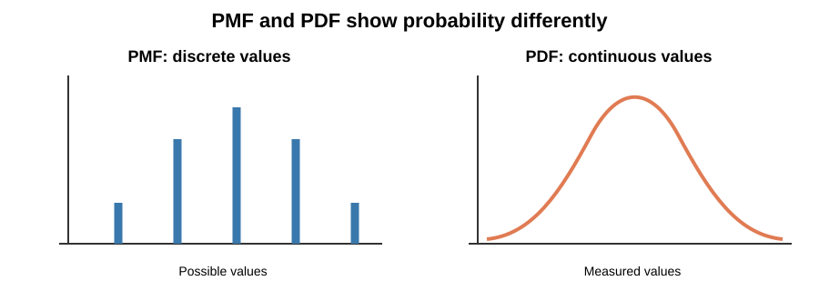
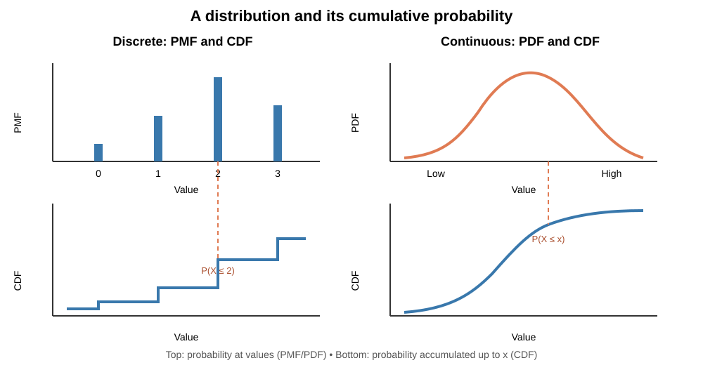
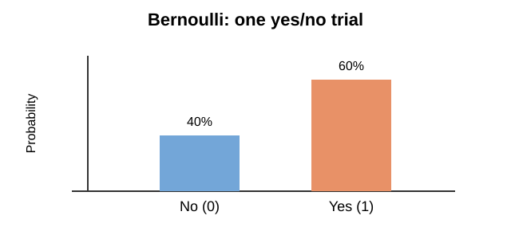
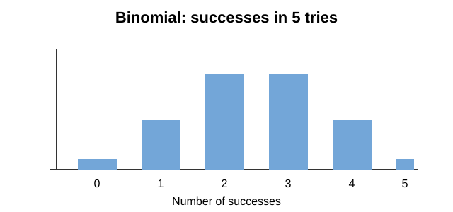
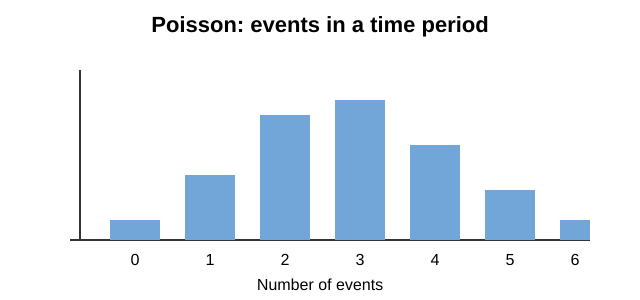
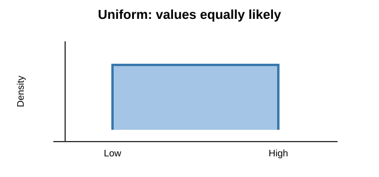
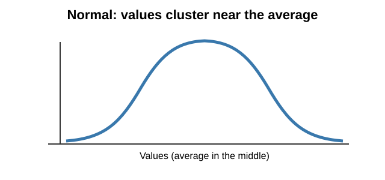
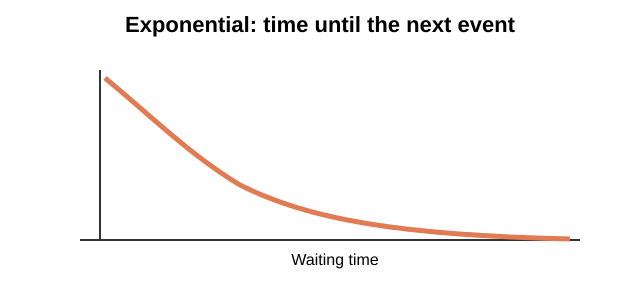

**Course Created by: Farhan Siddiqui**  
*Data Science & AI Development Expert*

---

# Statistics for AI: Complete Course Lectures

## The Foundations of Probability

### Why Probability Matters in AI

**Probability** describes how likely something is. AI uses it to make estimates when the answer is uncertain—for example, a spam filter estimates whether an email is spam.
---

### Basic Probability Concepts

**Sample Space and Events**
• **Sample Space (S)**: All possible outcomes
  - Coin flip: S = {Heads, Tails}
  - Dice roll: S = {1, 2, 3, 4, 5, 6}

• **Event**: A subset of outcomes we're interested in
  - Getting heads in coin flip
  - Rolling an even number on dice

**Probability Rules (Axioms)**
• Probability is always between 0 and 1
  - 0 ≤ P(Event) ≤ 1
  - P(Sample Space) = 1
  - P(Impossible Event) = 0

#### Dice Example
Rolling a fair die:
- P(rolling 3) = 1/6 ≈ 0.167
- P(rolling an even number) = P(2, 4, or 6) = 3/6 = 0.5
#### Coin Example
For a fair coin, there are two equally likely outcomes:
- P(heads) = 1/2 = 0.5
- P(tails) = 1/2 = 0.5

#### Simple AI Example: Spam Detection
Suppose 20 of 100 training emails are labeled as spam. The estimated probability that a randomly selected email in this set is spam is:
- P(spam) = 20/100 = 0.2 = 20%

A spam filter uses examples like these to estimate whether new emails are spam.

---

### Combining Probabilities

**Joint Probability P(A and B)**
• The chance that two events happen together.
• Example: Flip two fair coins. The chance of getting heads on both is 1/2 × 1/2 = 1/4.

**Marginal Probability P(A)**
• The chance of one event, without considering another event.
• Example: When flipping two fair coins, the chance that the first coin is heads is 1/2.

**Two-Coin Outcomes:**
The possible results are HH, HT, TH, and TT. Each is equally likely, so HH is 1 of 4 outcomes.
---

### Conditional Probability - The Game Changer

**What is Conditional Probability?**
It is the probability of an event when we already know that another event has happened.

• P(A|B) = Probability of A happening, **knowing that B already happened**
• Read as "Probability of A given B"

**Everyday Example - Traffic and Being Late:**
• P(Late for Work) might be 10% on a normal day
• P(Late for Work | Heavy Traffic) might be 60%
• Same outcome, but extra information changes everything!

**Another Relatable Example - Netflix and Mood:**
• P(Watch Comedy) = 30% (general preference)
• P(Watch Comedy | Had Bad Day) = 80% (comfort viewing)
• P(Watch Comedy | Celebrating) = 60% (feel-good content)

**Generative AI Chatbot Example — Predicting the Next Word:**
A chatbot uses earlier words to predict the next word. Using made-up numbers just to illustrate:
- P("coffee" as the next word in any text) = 1%.
- P("coffee" as the next word | the previous words are "I drink") = 40%.

The phrase "I drink" makes "coffee" more likely than it is in text generally.

**The Key Insight:**
New information completely changes probabilities. This is why AI systems ask for context!

**Simple Formula:**
P(A|B) = P(A and B) / P(B)
**Brief Example — Chatbot:**
Let A = the next word is “coffee,” and B = the previous words are “I drink.” If P(A and B) = 0.8% and P(B) = 2%, then:

P(A|B) = 0.008 / 0.02 = 0.40, or 40%.

**In Plain English:**
"How often A and B happen together" ÷ "How often B happens"

**Visual Thinking:**
Imagine all the days B happens. Of those days, what fraction also has A?

---

### Bayes’ Rule: Updating a Probability

**Bayes’ rule** helps us update an estimate when we get new evidence. It combines what was likely before with how strongly the new evidence points to an outcome.

Conditional probability asks for the chance of an event given some information. **Bayes’ rule helps calculate that chance when we know the reverse information**—for example, how often spam contains a phrase and how common spam is overall.

For example, a spam filter asks: **Given that an email contains a suspicious phrase, how likely is it to be spam?**

**Formula:**

P(A|B) = P(A and B) / P(B)

Rewrite the joint probability as P(B|A) × P(A):

P(A|B) = P(B|A) × P(A) / P(B)

For the spam example, A = Spam and B = Phrase, so:

P(Spam|Phrase) = P(Phrase|Spam) × P(Spam) / P(Phrase)

- **P(Spam):** how common spam is before checking the phrase.
- **P(Phrase | Spam):** how often spam emails contain the phrase.
- **P(Phrase):** how often all emails contain the phrase.
- **P(Spam | Phrase):** the updated chance that this email is spam.

#### Why use Bayes’ rule?

Suppose we want **P(Spam | Phrase)**: the chance an email is spam given that it contains “**claim your prize**.” The joint probability **P(Spam and Phrase)** may be hard to measure directly because it requires counting emails that are both spam and contain that phrase.

It may be easier to measure the reverse: **P(Phrase | Spam)**—among emails already labeled as spam, how many contain the phrase? We can also estimate how common spam is and how common the phrase is overall. Bayes’ rule combines these easier-to-find values to calculate **P(Spam | Phrase)**.

---

## Common Probability Distributions

A **random variable** represents an outcome with a number, such as the number of orders or the time until a customer arrives. Distributions describe the possible values and how likely they are.

These two kinds describe **numeric variables**, not categories such as product names or colors.

There are two main kinds:

- **Discrete:** values you can count, such as 0, 1, 2, 3 orders.
- **Continuous:** values you measure, such as time, height, or temperature.

A **PMF** gives the probability of each **discrete** value. A **PDF** shows where **continuous** values are more common; probability is the area under its curve.

A **cumulative distribution function (CDF)** works with both. It gives the probability of getting a value **less than or equal to x**. The graph rises as probability adds up: in discrete data it rises in steps; in continuous data it rises smoothly.

**Example:** If x is 2, the CDF gives the chance of getting **2 or less**.

### Discrete distributions

Discrete distributions describe **countable outcomes**.

#### Bernoulli: one yes-or-no result

A **Bernoulli distribution** models one trial with two outcomes: success or failure. For example, one visitor either signs up or does not.

The two bars show the **two possible outcomes** of one trial: no and yes.

**Use it when:** recording whether one customer **buys or does not buy**.

#### Binomial: count successes across trials

A **binomial distribution** counts successes across a fixed number of similar trials. For example, how many of 5 visitors sign up?

There are **5 trials** (the 5 visitors). Each bar shows the chance of that number of sign-ups. With a 50% chance per visitor, 2 or 3 sign-ups are most likely; **5 sign-ups is less likely** because all 5 visitors must sign up.

**Use it when:** counting how many of **5 customers sign up**; the number of tries is fixed.

#### Poisson: count events over time

A **Poisson distribution** models how many times an event happens in a set time or area. For example, how many support calls arrive in an hour?

The **time period is fixed**—for example, one hour. Each bar shows the chance of that many calls arriving in that hour. Counts near the average are more likely; very low or high counts are less common. Unlike binomial, we do not set a fixed number of trials.

**Use it when:** counting how many **support calls arrive in an hour**; there is no fixed number of call opportunities.

### Continuous distributions

Continuous distributions describe **measured values** that can take many values within a range.

#### Uniform: equal chance across a range

A **uniform distribution** means values in a range are equally likely. For example, a fair random number generator can select any value in its range with equal chance.

Unlike the discrete charts, this shows **measured values**; all values in the range are equally likely.

**Use it when:** a computer randomly picks a time between **0 and 1 second**, with every moment equally likely.

#### Normal: values cluster around an average

A **normal distribution** is the familiar bell shape. Values near the average are common; very low or high values are less common. Some measurements, such as errors in a process, can be roughly normal.

Unlike uniform, values **cluster near the average** and become less common toward either end.

**Use it when:** modeling small **measurement errors** that usually stay near zero, with large errors less common.

#### Exponential: waiting time until an event

An **exponential distribution** describes waiting time until the next event, such as the time until the next customer arrives. Short waits are more common than very long waits.

Unlike the symmetric normal curve, **short waits are more common** than long waits.

**Use it when:** estimating the **waiting time until the next support call** arrives.

**Quick guide:** Is the result a count or yes/no outcome? Start with a discrete distribution. Is it a measurement or waiting time? Start with a continuous distribution. Use a chart and the context to decide which subtype fits.
