## Exploratory Data Analysis (EDA)

### Why EDA is Critical for AI

**Note:** We completed a hands-on data visualization activity in the **Pandas Data Visualization** lecture. Use those plotting skills here to explore statistical patterns.

**The Foundation of Good AI**
• "Garbage in, garbage out" - bad data = bad models
• EDA helps us understand our data before building models
• Prevents costly mistakes and wrong conclusions

**What EDA Reveals:**
• Data quality issues (missing values, outliers)
• Hidden patterns and relationships
• Assumptions we need to check
• Ideas for feature engineering

---

### Measures of Central Tendency

**Mean - The Average**
• Sum of all values / number of values
• Sensitive to outliers
• Best for symmetric distributions

**Median - The Middle Value**
• The middle of sorted data; it is **one median value**.
• With an even number of values, average the two middle values.
• Less affected by outliers; useful for skewed data.

**Mode - The Most Common Value**
• The value that appears most often; a dataset can have more than one mode.
• **One mode:** [1, 2, 2, 3] → mode = 2.
• **Two modes:** [1, 1, 2, 2, 3] → modes = 1 and 2.
• **Three modes:** [1, 1, 2, 2, 3, 3, 4] → modes = 1, 2, and 3.

**Example - House Prices:**
Houses sold: $200K, $250K, $300K, $320K, $2M
- Mean = $614K (pulled up by mansion)
- Median = $300K (better representative)
- Mode = None (all different)

**Key Insight:** When mean >> median, data is right-skewed (has high outliers)

---

### Measures of Spread

**Variance and Standard Deviation**
• How much data varies around the mean
• **Variance = Average of squared differences from mean**
  - Formula: Var = Σ(x - mean)² / n
  - **Sample variance:** s² = Σ(x - x̄)² / (n - 1)
  - Use **n** for a full population and **n - 1** for a sample.
• **Standard Deviation = √Variance**
  - Same units as original data
• **Simple Example - Test Scores:** [70, 80, 90]
  - Mean = 80
  - Variance = [(70-80)² + (80-80)² + (90-80)²] / 3 = [100 + 0 + 100] / 3 = 67
  - Standard Deviation = √67 = 8.2 points

**Interquartile Range (IQR)**
• 75th percentile - 25th percentile
• Robust to outliers
• Contains middle 50% of data
• **Example - Daily Coffee Sales:** [12, 15, 18, 20, 22, 25, 28, 30, 35, 100000]
  - Q1 (25th percentile) = 18 cups
  - Q3 (75th percentile) = 30 cups
  - IQR = Q3 - Q1 = 30 - 18 = 12 cups
  - The **IQR stays small** because it describes the middle half of the data.

**Range**
• Range = maximum - minimum = 100000 - 12 = **99988 cups**.
• The range is very large because it is strongly affected by the extreme value.

**Outlier Detection Rule:**
• Lower limit = Q1 - 1.5 × IQR = 18 - 18 = **0 cups**.
• Upper limit = Q3 + 1.5 × IQR = 30 + 18 = **48 cups**.
• Any value below 0 or above 48 is an outlier by this rule. So **100000 cups is an outlier**.

---

### Understanding Distribution Shapes

**Skewness - Is it Symmetric?**
• Positive skew: Long tail to the right (income, house prices)
• Negative skew: Long tail to the left (exam scores in easy test)
• Zero skew: Symmetric (height, temperature)

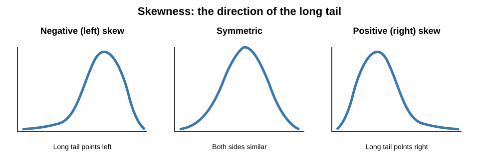

The **middle curve is a normal distribution**: a symmetric, bell-shaped pattern with most values near the average.

**Kurtosis - How "Peaky" is it?**
• **Leptokurtic (high kurtosis):** sharper peak and heavier tails.
• **Mesokurtic (normal kurtosis):** the normal distribution; kurtosis = 3.
• **Platykurtic (low kurtosis):** flatter peak and lighter tails.

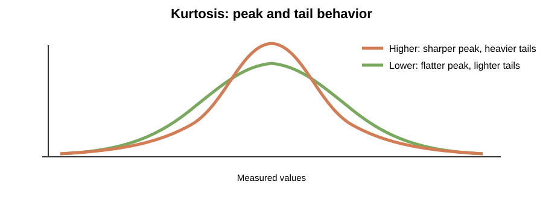

The **normal distribution** is the reference shape: symmetric and bell-shaped, with moderate tails.

**Why This Matters for AI:**
• Many algorithms assume normal distributions
• Skewed data might need transformation (log transform)
• Kurtosis affects outlier sensitivity

---

### Essential Visualizations

Choose a visualization based on the **number** and **type** of variables. Each example below shows one chart or table type.

#### 1. Univariate: one variable

**Numeric variable** (such as Sales):

**Histogram** — groups values into ranges to show the distribution.

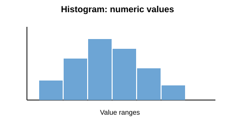

**Box plot** — summarizes the median, spread, and possible outliers.

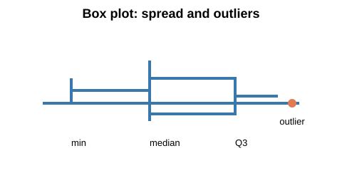

**Density plot** — shows a smooth version of a numeric distribution.

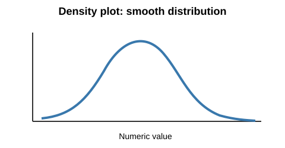

**Categorical variable** (such as Product Type):

**Bar chart** — compares the counts of categories.

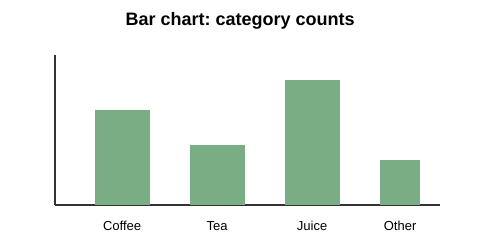

#### 2. Bivariate: two variables

**Numeric + numeric** (such as Marketing and Sales):

**Scatter plot** — shows the relationship between two numeric variables.

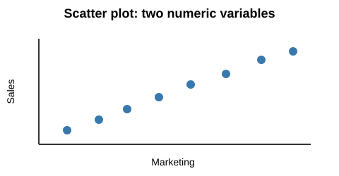

**Correlation matrix** — uses color and values to summarize pairwise linear relationships.

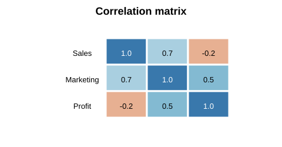

**Numeric + categorical** (such as Sales by Product Type):

**Side-by-side box plots** — compare medians and spread across categories.

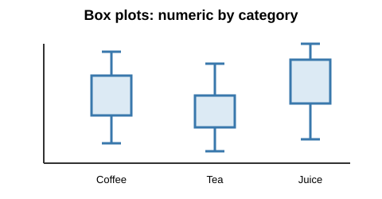

**Grouped histograms** — compare value ranges between categories.

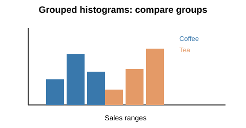

**Grouped density plots** — compare smooth distribution shapes between categories.

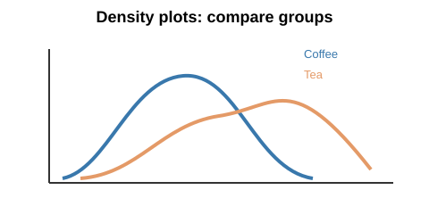

**Categorical + categorical** (such as Product Type and Market):

**Cross-tabulation** — lists the count for each category combination.

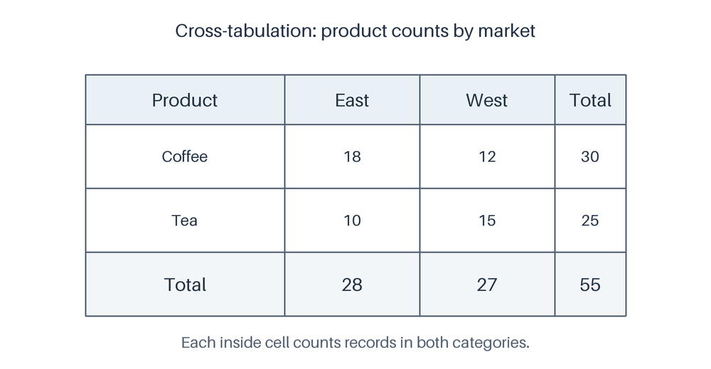

**Grouped bar chart** — compares the category combinations visually.

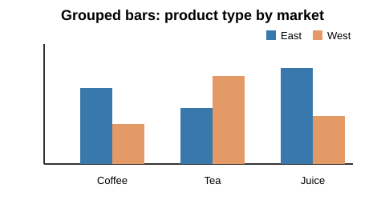

In this example, **blue = East** and **orange = West**.

#### 3. Multivariate: three variables

**Three numeric variables** (such as Sales, Marketing, and Profit):

**3D scatter plot** — places each observation using three numeric values.

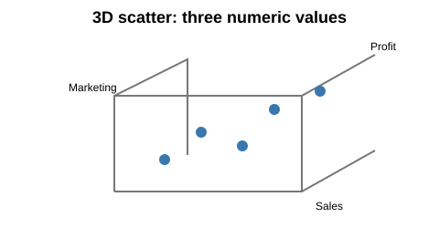

**Pair plot** — shows a scatter plot for each pair of numeric variables.

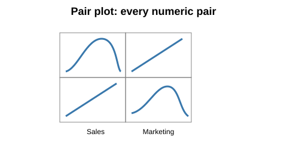

**Two numeric + one categorical** (such as Sales, Marketing, and Product Type):

**Colored scatter plot** — uses color to identify each category.

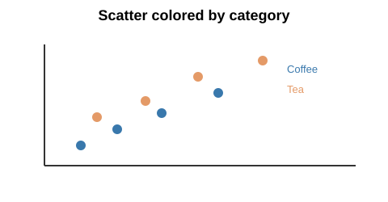

**Faceted scatter plot** — puts each category in its own panel.

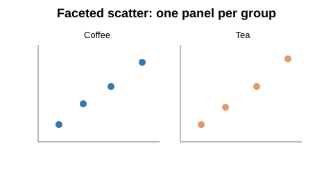

**One numeric + two categorical** (such as Sales, Product Type, and Market):

**Grouped box plots** — compare the numeric values across both categories.

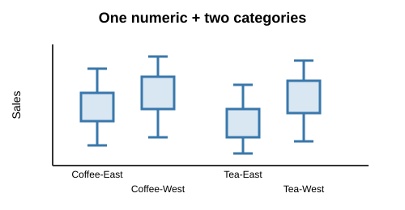

**Heatmap of group averages** — uses color to compare an average across category combinations.

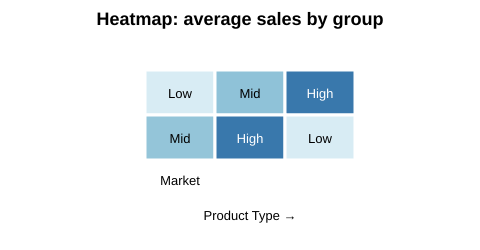

**Three categorical variables** (such as Product Type, Market, and Store Size):

**Faceted bar chart** — compares category counts in separate panels.

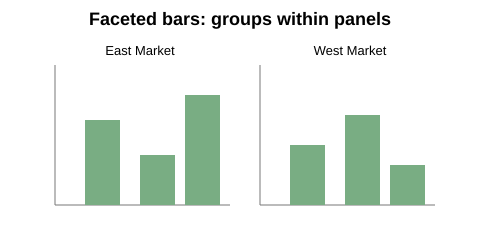

**Three-way cross-tabulation** — lists counts for combinations of all three categories.

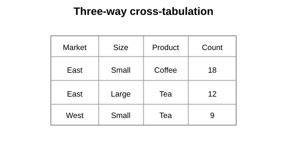

Start with the **simplest chart** that answers your question. Add visual details only when they help compare groups or reveal a pattern.
