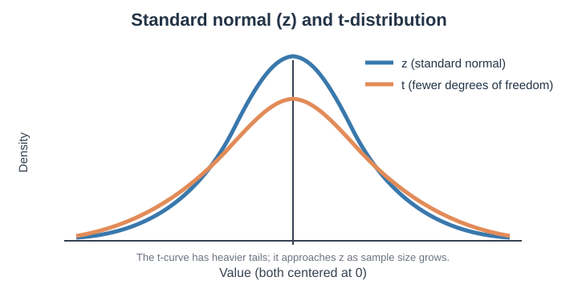
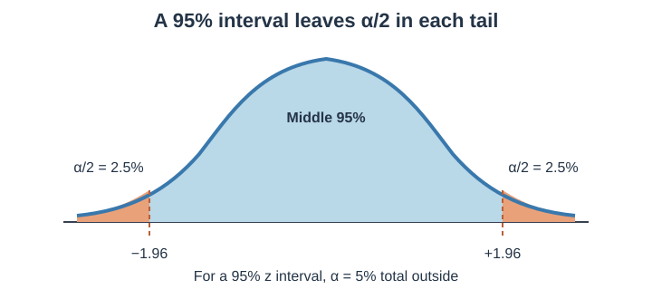
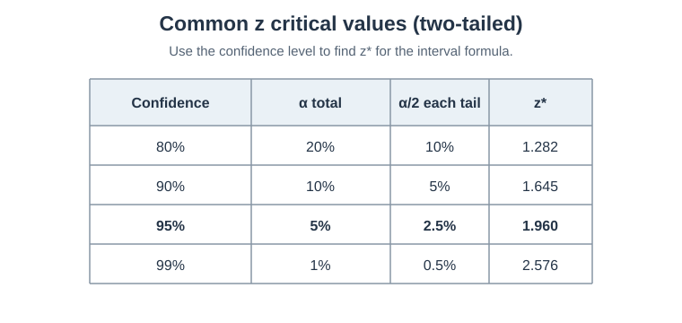

## Central Limit Theorem - The Magic Behind Statistics

### Population vs Sample - The Fundamental Distinction

**Population**
• All possible data points we care about
• Usually impossible to measure completely
• Has true parameters (μ, σ)

**Sample**
• Subset of population we actually observe
• What we use to make inferences
• Has sample statistics (x̄, s)

**Examples:**
• Population: All customers who might buy our product
• Sample: 1000 customers we surveyed

**Key Challenge:** How can we trust conclusions from a sample?

---

### Law of Large Numbers - Building Intuition

**The Simple Idea:**
As sample size increases, sample mean gets closer to true population mean

**Coin Flip Example:**
• Flip 10 times: might get 70% heads (7/10)
• Flip 1000 times: likely close to 50% heads
• Flip 1 million times: very close to 50% heads

**Why This Matters for AI:**
• Gives us confidence that training data represents reality
• Justifies using sample performance to estimate true performance
• Explains why "more data usually helps"

---

### Central Limit Theorem - The Miracle of Statistics

**The Main Idea:**
If we repeatedly take random samples of the same size and calculate each sample’s mean, those means tend to form an approximately normal, bell-shaped distribution as the sample size grows. This works best when observations are independent and the population does not have extreme values or infinite variance. A sample size of 30 is a **rough guide**, not a guarantee; highly skewed data may need larger samples.

**Key Points:**
• The pattern describes **sample means**, not the original data.
• Sample means vary less than individual observations.
• Standard error = σ/√n; larger samples usually give more stable means.

**Dice Example:**
• Roll a die 30 times and calculate the average. That is **one sample mean**.
• Repeat many times, each time using a new set of 30 rolls and calculating its mean.
• Plot all the sample means. They will tend to form a bell-shaped pattern around 3.5.

**Why It Matters:**
This pattern helps us estimate population averages and understand confidence intervals and hypothesis tests.

---

## Confidence Intervals - How Sure Are We?

### From Point to Interval Estimates

**Point Estimate - A Single Number**
• Sample mean = 85% accuracy
• But how precise is this estimate?

**Interval Estimate - A Range of Plausible Values**
• Example: "Average student height is 5'6" ± 2 inches"
• Instead of just saying 5'6", we say "between 5'4" and 5'8""
• Acknowledges uncertainty in our estimate

---

### Understanding Confidence Intervals

**Confidence interval formula:**

**Point estimate ± (critical value × standard error)**

For a sample mean:

- **t formula:** x̄ ± t* × (s / √n) — use when the population standard deviation is unknown; this is common in practice.
- **z formula:** x̄ ± z* × (σ / √n) — use when the population standard deviation is known.

In both formulas, **x̄ is the point estimate** (the sample mean) and **n** is the sample size. The standard error is **s / √n** for t and **σ / √n** for z. For a 95% interval, **z*** is about 1.96; **t*** depends on the sample’s degrees of freedom.

---

### Constructing Confidence Intervals

**Understanding z vs t Distributions**

**z Distribution (Standard Normal):**
• Use when population standard deviation (σ) is **known**
• Bell-shaped, mean=0, std dev=1
• Fixed shape, same critical values always
• Example: z = 1.96 for 95% CI

**t Distribution:**
• Use when population standard deviation (σ) is **unknown** (most real cases!)
• Similar to z but with "fatter tails" (more uncertainty)
• Shape depends on degrees of freedom (df = n-1)
  - **Example:** With 6 observations, df = 6 - 1 = 5.
• As sample size increases, t approaches z distribution
• For n>30: t ≈ z (practically the same)

**When to Use Which:**

| Situation | Distribution | Formula |
|-----------|-------------|---------|
| σ known (rare) | z | x̄ ± z_(α/2) × (σ/√n) |
| σ unknown, n≤30 | t | x̄ ± t_(α/2,df) × (s/√n) |
| σ unknown, n>30 | z or t | x̄ ± z_(α/2) × (s/√n) |

For a **95% interval**, α = 0.05 is split between two tails, so **α/2 = 0.025 (2.5%) per tail**. The middle 95% lies between the critical values.

**Z critical-value table:** For a 95% interval, use **z* = 1.96**.

**Worked Example - Customer Satisfaction (Using Mean Formula):**
• Sample: 100 customers
• Sample mean satisfaction = 7.2 (out of 10)
• Sample standard deviation = 1.5
• Want 95% confidence interval

**Step-by-Step Calculation:**
• **Formula Used:** x̄ ± z_(α/2) × (s/√n) (unknown σ, large sample)
• **Critical Value:** z_(0.025) = 1.96 (for 95% CI)
• **Standard Error:** s/√n = 1.5/√100 = 1.5/10 = 0.15
• **Margin of Error:** 1.96 × 0.15 = 0.294
• **Final CI:** 7.2 ± 0.294 = [6.91, 7.49]

**Interpretation:** We're 95% confident the true average customer satisfaction is between 6.91 and 7.49

---

### Bootstrap - A Modern Approach

**The Bootstrap Idea:**
• Resample from your original sample (with replacement)
• Calculate statistic for each resample
• Use distribution of these statistics to create CI

**Why Bootstrap is Powerful:**
• Works for any statistic (median, correlation, etc.)
• No complex formulas needed
• Very intuitive

**Simple Bootstrap Example:**
Original sample: [2, 4, 6, 8, 10]
Bootstrap sample 1: [2, 6, 6, 10, 4] → mean = 5.6
Bootstrap sample 2: [8, 8, 2, 10, 6] → mean = 6.8
... (repeat 1000 times)
95% CI = 2.5th and 97.5th percentiles of bootstrap means

---

## Hypothesis Testing - Is This Effect Real?

### The Logic of Hypothesis Testing

**The Scientific Method in Statistics:**
• Start with a claim to test
• Assume the opposite (null hypothesis)
• Collect evidence
• Decide if evidence is strong enough to reject the null

**Key Components:**
• **Null Hypothesis (H₀)**: "No effect" or "no difference"
• **Alternative Hypothesis (H₁)**: What we want to prove
• **Test Statistic**: Measures how far our data is from H₀
• **P-value**: Probability of seeing our result if H₀ is true

---

### Understanding P-values

**What is a P-value?**
Probability of observing a test statistic as extreme as (or more extreme than) what we actually observed, assuming the null hypothesis is true

**Common Misinterpretations:**
❌ "Probability that null hypothesis is true"
❌ "Probability of making a mistake"
✅ "Probability of our data, given null hypothesis is true"

**Decision Rule:**
• If p-value < α (usually 0.05): Reject null hypothesis
• If p-value ≥ α: Fail to reject null hypothesis

**Example:**
H₀: New website design doesn't improve conversion rate
We observe p-value = 0.03
Conclusion: If the new design really had no effect, we'd only see results this extreme 3% of the time. This is unlikely, so we reject H₀.

---

### Types of Errors: A Medical Test Example

Suppose a screening test checks whether a patient has a **malignancy**. A follow-up examination tells us the actual condition.

| Actual condition | Test says malignancy (positive) | Test says no malignancy (negative) |
|---|---|---|
| Malignancy present | **True positive:** correctly flags malignancy | **False negative (Type II):** misses the malignancy |
| No malignancy | **False positive (Type I):** incorrectly flags malignancy | **True negative:** correctly reports no malignancy |

- **Type I error (α):** the test is positive even though no malignancy is present.
- **Type II error (β):** the test is negative even though malignancy is present.

Reducing false alarms can sometimes make a test more likely to miss real cases, so medical screening balances both risks. A positive screening result usually needs follow-up; it is not by itself a diagnosis.

### Common Statistical Tests

**One-Sample t-test**
• Tests if sample mean differs from known value
• H₀: μ = μ₀
• Example: Is average customer rating different from 4.0?

**Two-Sample t-test**
• Tests if two group means are different
• H₀: μ₁ = μ₂
• Example: Do men and women have different average spending?

**Proportion Test**
• Tests if sample proportion differs from known value
• H₀: p = p₀
• Example: Is click-through rate different from 5%?

---

### A/B Testing - Statistics in Action

**The Setup:**
• Group A: Current website (control)
• Group B: New website (treatment)
• Question: Is conversion rate significantly different?

**The Test:**
H₀: p_B = p_A (no difference in conversion rates)
H₁: p_B ≠ p_A (there is a difference)

**Example Calculation:**
• Group A: 100 conversions out of 2000 visitors (5%)
• Group B: 130 conversions out of 2000 visitors (6.5%)
• Two-proportion z-test gives p-value = 0.018
• Conclusion: Reject H₀, new design performs better

**Practical Considerations:**
• Sample size planning
• Multiple testing corrections
• Business significance vs statistical significance

---

